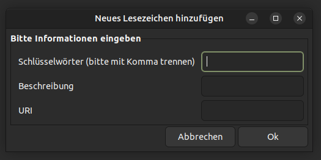
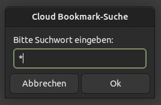
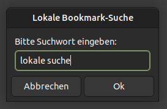

# cloudybm

Ein kleines Linux-Tool, um Lesezeichen auf einem entfernten Rechner via SSH zu verwalten.

**Vorbereitung**

Für dieses Tool wird eine bestehende SSH-Verbindung vorausgesetzt. Für die Einrichtung von SSH gibt es sehr gute Anleitungen im Internet. Eine ist zum Beispiel:  
<https://wiki.ubuntuusers.de/SSH/>  

Außerdem wird das Installieren von *ssh-askpass* (oder einem ähnlichen Paket wie *ssh-askpass-gnome*, etc.) empfohlen.

Die folgenden Schritte sind auf dem Client-Rechner auszuführen:

Repository klonen:  
```bash
https://github.com/CarstenHa/cloudybm
```

config-Datei im Ordner `cloudybm/config` kopieren:
```bash
cp cloudybm/config/cloudybm.bsp cloudybm/config/cloudybm.cfg
```
und anschließend ausfüllen. Die folgende Installation mit install.sh funktioniert nur mit ausgefüllter cloudybm.cfg.  

Installieren:  
```bash
cd cloudybm && ./install.sh
```

Deinstallieren:  
```bash
./install.sh -u
```
Hinweis:  
Bei der Deinstallation werden nur die lokalen Symlinks auf die Repo-Dateien entfernt. Der Repository-Ordner, die ggf. bei der Installation erstellten Ordner sowie Dateien und Ordner auf dem Server werden nicht gelöscht.

Das Programm kann einfach mit:  
```bash
cd /path/to/cloudybm && git pull
```
aktualisiert werden.

**Nutzung**

Nach der Installation findet man die Programmteile in der Rubrik Zubehör.  


Zur Vorgehensweise:  
Das Skript *searchbookmark* ist für die Suche und das Löschen von Lesezeichen aus der Lesezeichen-Datei bookmarks.txt zuständig. Die Bearbeitung der Datei bookmarks.txt ist nur auf dem Server möglich. Das Durchsuchen ist auch von der lokalen bookmarks.txt möglich.  
Das Skript *newbookmark* leitet das Hinzufügen eines neuen Lesezeichens ein. Dabei übergibt das Skript die Daten an das Skript *cloudybm* auf dem Server. Dieses Skript ist dann für das eigentliche Hinzufügen des Lesezeichens zuständig.

Über eine Maske können entweder neue Lesezeichen hinzugefügt werden oder nach bestehenden Lesezeichen gesucht bzw. Lesezeichen gelöscht werden. Neue Lesezeichen können nur hinzugefügt werden, wenn der Server erreichbar ist.  


Eine Kopie der Lesezeichen-Datei (bookmarks.txt) wird nach jeder Änderung auf den Client-Rechner kopiert. Somit sind die Bookmarks auch verfügbar, wenn mal keine Verbindung zum Server besteht.

Durch Angabe von `*` in der Suchmaske, werden alle Lesezeichen angezeigt.  


Ob die Serverdatei oder die lokale Lesezeichen-Datei gerade durchsucht wird, kann man übrigens am Fensterkopf erkennen:  


Weitere Suchmusterbeispiele:  
`wort1\|wort2` : Findet Einträge mit wort1 oder wort2  
`teil1.*teil2` : Findet String von teil1 bis teil2 (auch Spaltenübergreifend)  
`go.gle` : Findet Einträge mit goigle, goagle, gougle, usw.  

Durch Doppelklick werden Links in der Standardanwendung (i.d.R. der Browser)  geöffnet.  

Terminal-Beispiele mit cloudybm (wenn man mit SSH auf dem Server ist):  
```bash
# Aufrufen der Hilfe von cloudybm
/path/to/cloudybm -h
# Hinzufügen eines Lesezeichens
/path/to/cloudybm -B "keywort1,keywort2,etc." "Hier steht die Beschreibung" "https://example.com"
# oder (ohne Schlüsselwörter und Beschreibung):
/path/to/cloudybm -B "" "" "https://example.com"
# Durchsucht bookmarks.txt nach SUCHWORT und startet danach eine Abfrage, welche Zeilen gelöscht werden sollen.
/path/to/cloudybm -s SUCHWORT -d ?
# Löscht mehrere Zeilen in einem Rutsch.
/path/to/cloudybm -d NUM -d NUM -d NUM

```
**Exitcodes**

0 - Erfolgreiches Hinzufügen eines Lesezeichens.  
1 - Variable remotepath ist leer. Die Datei bookmarks.txt konnte nicht eindeutig ermittelt werden.  
2 - URI ist bereits in bookmarks.txt vorhanden. Es wird kein neues Lesezeichen eingetragen.  
3 - Keine gültige URI. Es werden nur Einträge aufgenommen, die die Zeichen `://` enthalten.  
4 - Kein Lesezeichen gefunden.  
5 - Fehlerhafte Einleitung des Löschvorgangs (Keine aktive Terminalsitzung für Abfrage).  
6 - Fehler beim Löschvorgang.

**Lizenzhinweise**

SVG-Icons in den Unterordnern von hicolor sind von:
Fonticons, Inc. (<https://fontawesome.com>)  
SVG-Icons are licensed CC BY 4.0 License (<https://creativecommons.org/licenses/by/4.0/>)  
Creative Commons Attribution 4.0 International License  
Modified by Carsten Jacob (<https://github.com/CarstenHa/cloudybm>)

Viel Spaß mit diesem kleinen Programm :)

<https://github.com/CarstenHa/cloudybm>
